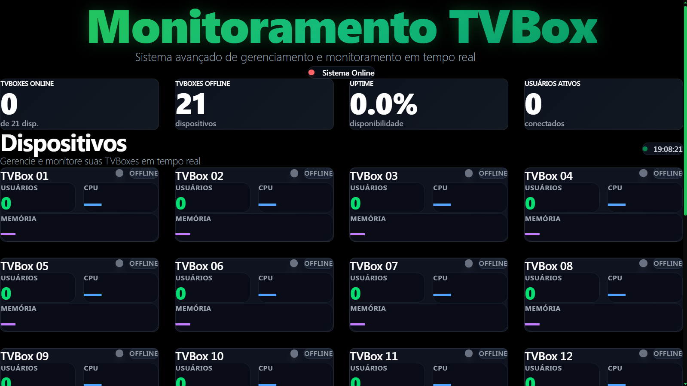
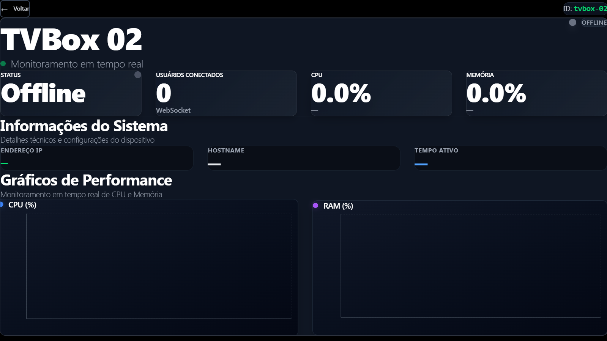

# TVBoxClusterMonitor

**Reapurpose • Orchestrate • Scale**

TVBoxClusterMonitor is a comprehensive monitoring solution designed for clusters of repurposed Android TV boxes. Initiated as a research project and evolved into a full-stack system, it aims to extract maximum value from discarded hardware by implementing modern infrastructure best practices. The solution provides real-time visibility, automated discovery, and a foundation for scalable distributed computing using low-cost edge devices.

## Key Features

- **Real-time Resource Monitoring**: Live tracking of CPU usage, memory consumption, and system health.
- **Interactive Dashboard**: Clean, responsive UI with dark mode, featuring detailed charts and metrics visualization.
- **Automated Discovery**: Automatic detection of TV Boxes on the network.
- **Detailed Insights**: Modal views for individual device status, resource history, and performance metrics.
- **Scalable Architecture**: Built with Node.js, React, and Docker for easy deployment and future expansion.

## Dashboard Overview

  
  

## Technology Stack

- **Backend**: Node.js, Express, Socket.IO
- **Frontend**: React, Vite, Recharts, TailwindCSS
- **Infrastructure**: Docker, systemd

## Roadmap & Future Improvements

- **Advanced Orchestration**: Integration with Kubernetes for container management.
- **Microservices Architecture**: Decoupling services for better scalability and resilience.
- **Dynamic Horizontal Scaling**: Automated scaling based on workload metrics.
- **Enhanced Observability**: Detailed network I/O, disk I/O, and storage metrics.
- **Distributed Edge Computing**: Framework for deploying and managing edge workloads.

## Use Cases and Innovation Potential

The TVBoxClusterMonitor transforms obsolete hardware into a viable computing cluster, ideal for various innovative applications:

### 1. Low-Cost Distributed Computing
- **Parallel processing** for non-latency-sensitive tasks (e.g., batch data processing).
- **Cluster computing** for simulations and large-scale computations.
- **Decentralized Edge Computing** for IoT gateways and local data processing.
- **Distributed backup** and data redundancy systems.

### 2. Research and Education
- **Learning Environments** for distributed systems concepts and cluster management.
- **Testbeds** for algorithm development (load balancing, container orchestration).
- **Infrastructure Simulation** for complex scenarios with resource constraints.

### 3. Microservices Infrastructure
- **Lightweight Containerization** for hosting microservices.
- **Distributed API Gateways** and load balancers.
- **Cache Clusters** (e.g., Redis) and distributed session storage.

### 4. Monitoring and Observability
- **Real-time Metrics** collection and aggregation.
- **Proactive Alerts** based on configurable thresholds.
- **Historical Performance Analysis** for trend identification.

## Expected Results & Metrics

### Immediate Benefits
- **Cost Reduction**: Up to 80% savings compared to traditional hardware.
- **Sustainability**: Promotes hardware reuse and reduces e-waste.
- **Full Visibility**: Centralized dashboard for all cluster resources.
- **Dynamic Scalability**: Add or remove nodes on demand.
- **High Availability**: Redundancy across multiple devices.

### Performance Targets
yaml
Monitoring:
  - Collection Latency: < 250ms
  - Update Frequency: 3s
  - Expected Uptime: > 99.5%
  - Device Capacity: 50+ TVBoxes

Typical TVBox Specs:
  - CPU: 1-4 ARM cores
  - RAM: 1-4GB
  - Storage: 8-32GB
  - Network: 100Mbps-1Gbps

## Getting Started

To get started with TVBoxClusterMonitor, refer to the specific setup instructions in the `docker-compose.yml` and environment configuration files located in the project repository.

### Prerequisites
- Docker & Docker Compose
- Node.js (for development environment)
- TV Boxes with SSH access enabled

## Contributing

Contributions are welcome! Please read our `CONTRIBUTING.md` for details on our code of conduct and the process for submitting pull requests.

## License

This project is licensed under the MIT License - see the `LICENSE` file for details.

---

*TVBoxClusterMonitor - Transforming discarded hardware into powerful computing resources.*
